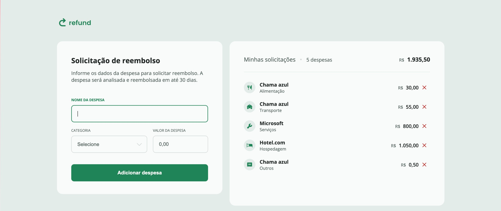

## Refund - Refund Request
Description:
This project implements a simple and intuitive interface for requesting expense reimbursements, allowing users to add expenses and track their requests. Expenses are reviewed and reimbursed within 30 days.

### Features
- Add expenses: Users can add a new expense by entering the name, category, company that will reimburse it, and amount;
- Track requests: Displays a list of expenses already requested for reimbursement;
- Categorization of expenses: The system allows expenses to be categorized for easy organization and visualization.
